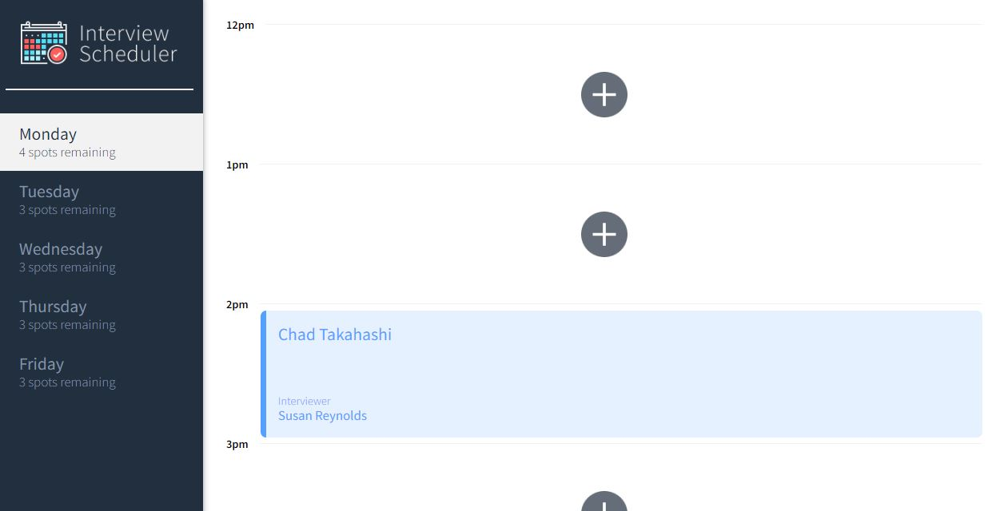
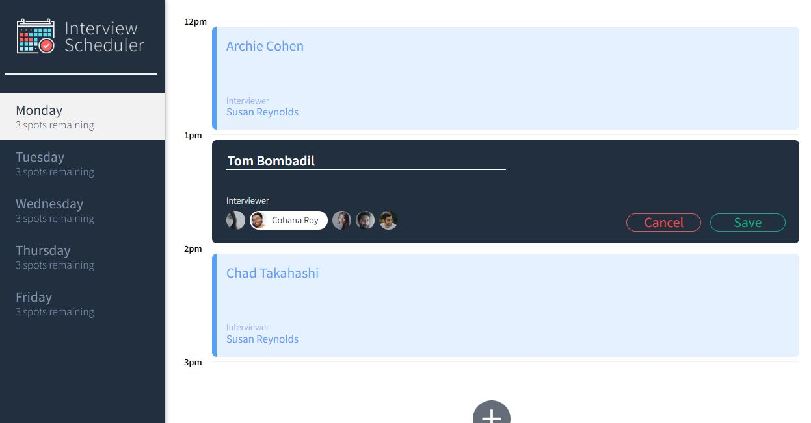

# Interview Scheduler App
  Interview scheduler app presents a list of week days(excludes weekends). For each day there are slots where a user can book an appointment(provided the slot is available), the user types in their name and selects one of the available interviewers. Any appointment can be edited or deleted from the interface.

## Setup
  1. Clone this repository onto your local device.
  2. Install dependencies using the `npm install` command from reactServer directory.
  3. Follow the setup instructions for serving the database located in the README file that is within the dataBaseServer directory.
  4. Start the database server using the `npm start` command from within dataBaseServer directory. The database will be served at <http://localhost:8001/>.
  5. Start the client web server(in a separate terminal) using the `npm start` command from reactServer directory. The client interface app will be served at <http://localhost:8000/>.
  6. Go to <http://localhost:8000/> in your browser and check out the features of this web page.

## Running Tests
  - This app is setup with testing capabilities for both jest and cypress.
  - To test using jest have both database server and client interface server running. On a separate terminal use command `npm test` to run the jest tests from within the reactServer directory.
  - To test using cypress; 
    - have both database server and client interface server running. Make sure to run the database server with the command `npm run test:server` so that the tests aren't performed on the main database. If firing the command `npm run test:server` for the first time, go to the url <http://localhost:8001/api/debug/reset> in order to generate test data. If running this command from a windows shell terminal first install `npm install -g win-node-env`.
    - On a separate terminal use command `npm run cypress` from within the reactServer directory. 

## Running Storybook Visual Testbed
- Many features of this app were developed using storybook so that the added features could be created independently from the main app and only after their unique functionalities where working as expected they were added to the main app
- To run storybook use the command `npm run storybook` from withing the reactServer directory, then go to url http://localhost:9009/

## Final Product

## Dependencies in reactServer directory
- "axios": "^0.2.0",
- "classnames": "^2.2.6",
- "normalize.css": "^8.0.1",
- "react": "^16.9.0",
- "react-dom": "^16.9.0",
- "react-scripts": "3.4.4"
- "@babel/core": "^7.4.3",
- "@storybook/addon-actions": "^5.0.10",
- "@storybook/addon-backgrounds": "^5.0.10",
- "@storybook/addon-links": "^5.0.10",
- "@storybook/addons": "^5.0.10",
- "@storybook/react": "^5.0.10",
- "@testing-library/jest-dom": "^4.0.0",
- "@testing-library/react": "^8.0.7",
- "@testing-library/react-hooks": "^8.0.1",
- "babel-loader": "8.1.0",
- "prop-types": "^15.8.1",
- "react-test-renderer": "^16.9.0",
- "sass": "^1.53.0"
- "jest": "^24.8.0"